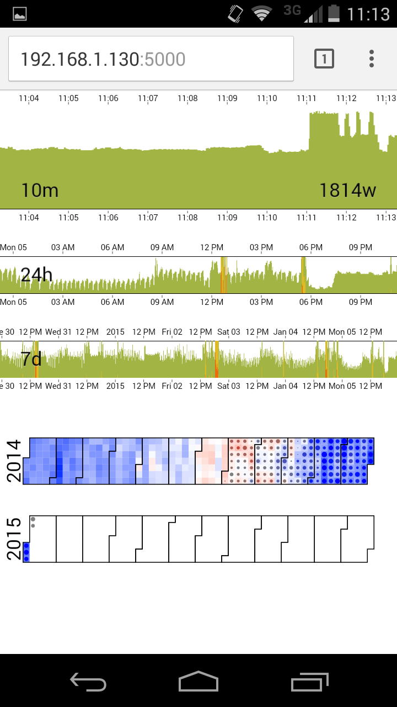

Screenshot
==========

NOTE
====

This project is still under development and is not ready to use unless you're
prepared to work through some bugs. It's useable, if you're brave.

Setup
=====

First you need to wire up a TSL2561 sensor (I use the one from Ada Fruit) to
your Raspberry Pi's i2c ports (TODO: wiring instructions). This sensor should
be taped or otherwised attached to your electric meter, right over the blinking
IR LED (TODO: how to check meter compatibility).

These instructions refer to the Raspberry Pi and your web server as two
different computers, but they can be one in the same if you want.

Don't forget, for future reference, that to run any of the Python scripts
(juiceinformant.py, hwmon.py, push.py), you must first be in the
"juiceinformant" directory.

If you want to use a virtualenv (you'll know if this is you), go ahead, but
make sure to use --system-site-packages so smbus works, or compile smbus-cffi
into your virtualenv.

On your RPi, install libraries:

    $ sudo apt-get install python-smbus
    $ pip install -r requirements.txt

Setup i2c on the RPi:

https://learn.adafruit.com/adafruits-raspberry-pi-lesson-4-gpio-setup/configuring-i2c

Make i2c accessible without using root:

    $ sudo adduser yourusername i2c

Now create a file in this project directory, called "secret", and type some
gibberish into it. This is the password that prevents anyone from submitting
bogus data to your server.

*If* you have a separate web server, copy the project to that server, and
install libraries on it:

    $ rsync -va ./ user@server:juiceinformant/
    $ ssh user@webserverhost
    $ sudo apt-get install build-essential python-dev

If using virtualenv, activate your env, then:

    $ pip install -r requirements.txt

If not using virtualenv:

    $ sudo pip install -r requirements.txt

Now install redis on the web server and start it up.

    $ sudo apt-get install redis-server

Start up the Flask/uwsgi server on the web server:

    $ uwsgi --http 0.0.0.0:5000 --master -w juiceinformant:app --processes 4

Back on the RPi, start up the hardware monitoring script as root:

    $ python hwmon.py

This is now logging to a file called blink-log. The other script to run on the
RPi will read from this log file and continually try to send updates to the
web server:

    $ python push.py localhost:5000

It should say stuff like this:

    Sent batch[1]: 1381518599.379515...1381518599.379515

It may also complain with error messages if it can't connect, or the server is
giving it an unexpected response, etc. You can just leave it running and it'll
recover once the problems are resolved.

Now, stop all those processes, install supervisord.conf, and use the included
supervisord.conf (after editing the "/home/nick" and username "nick" to
something appropriate for you) to run them all:

    $ supervisord -c juiceinformant/supervisord.conf

This above file assumes you're running everything just on one machine (contrary
to the rest of the instructions). If you want to run on two separate machines,
just set up supervisord on each machine and delete the jobs that aren't
applicable to each machine. On the RPi, you need hwmon.py and push.py running.
On the web server you need uwsgi running.

Set up a crontab for your user (run crontab -e) with these two jobs:

    @reboot supervisord -c juiceinformant/supervisord.conf
    0 5 * * * cd juiceinformant; source env/bin/activate; python juiceinformant.py --update-dd

This will make sure everything runs at boot in the future, and it will fetch
the heating/cooling degree day data for the previous day early every morning
(TODO: figure out when this file actually gets updated)

You can delete and re-build the Redis database trivially; just run "redis-cli
flushdb" on the web server to delete it, restart push.py afterwards and it'll
push all the old log data to repopulate Redis. However, the blink-log file is
irreplaceable. It is the canonical place where the log data lives. If you want
to have a backup of your data, then backup blink-log regularly.

The log file will grow up to maybe a hundred MB per year depending on your
electricity usage. After a long time it might become a disk space hog,
depending on how much space you have available. (The Redis instance on the
remote server doesn't grow appreciably after the first week, as it only retains
a very compact summary of daily use past 7 days.)
